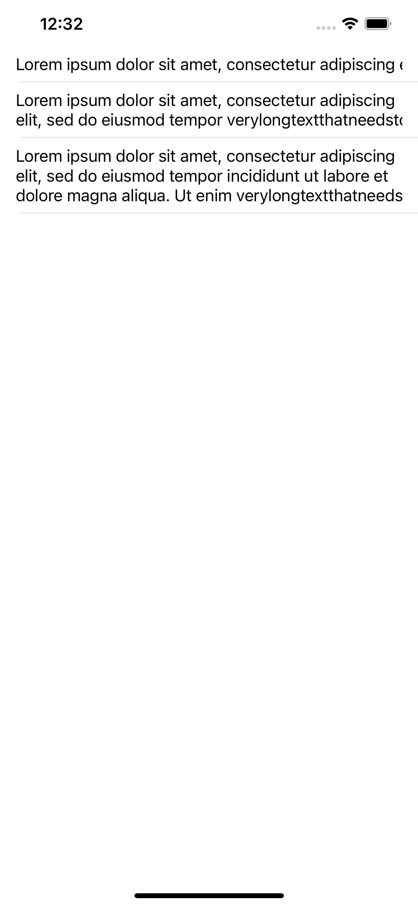
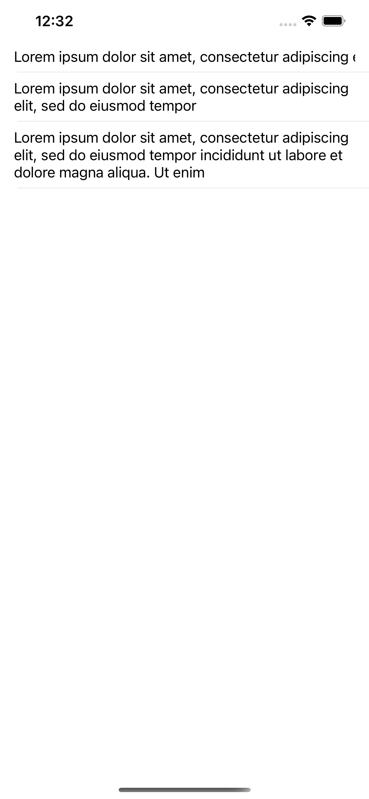

# UILabel-LineBreak-Bug

This project demonstrates the problem with `.lineBreakMode` of `UILabel` in iOS 15.2. This issue is reproduced only in iOS 15.2 and where `UILabel` has 2 and more lines.

I ran project on Xcode 13.2.1, but issue reproduced already with Xcode 13 and 13.1.

## How to reproduce

1. Run project with Xcode 13 on iOS 15 or 15.1. You will see that the texts are cut off as expected (with `lineBreakMode = .byClipping`).
2. Run project with same Xcode on iOS 15.2. You will see that texts are not cut off. The last word that should be cut off completely is not shown.

Here below are screenshots of issue:

There is no problem with iOS 15 | There is a problem with iOS 15.2
:------------------------------:|:-------------------------:
 | 

## Solution

No solution found on December 28 2021.

If you have found a solution, please notify me in any way
